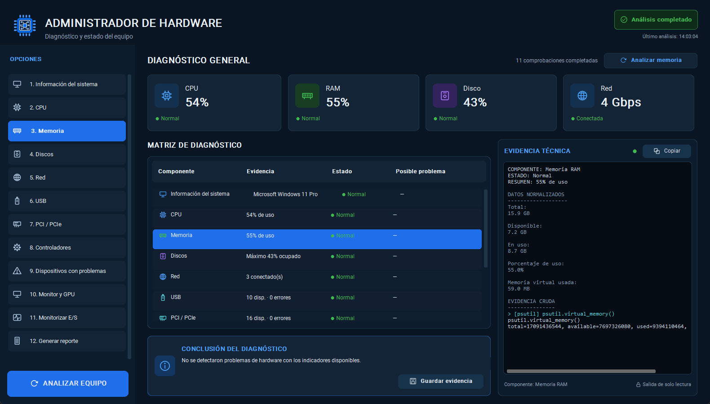

# Hardware Diagnostic & Repair Assistant

Proyecto personal de diagnóstico de hardware para Windows, orientado a usuarios
y técnicos. Recopila información real, presenta evidencia comprensible y ayuda
a investigar posibles problemas. Su evolución comercial se desarrolla por fases.

La aplicación actual funciona localmente y **no utiliza base de datos**.
Las funciones de IA, recomendación de compras y actualización asistida de
controladores están en investigación; todavía no están integradas.



## Funciones disponibles

- Información del sistema, CPU, RAM, almacenamiento y red.
- Dispositivos USB y PCI/PCIe, controladores y monitor/GPU.
- Detección de estados problemáticos y análisis por sección.
- Matriz de resultados, conclusiones y consola de evidencia de solo lectura.
- Muestra de actividad de E/S y exportación HTML.

Consultar el [plan de desarrollo](BUILD_PLAN.md) para el estado de cada fase.
Las capturas y el paquete existente pueden corresponder a una revisión anterior
al código fuente; cada distribución debe identificar su versión y pruebas.

## Ejecutar

Extraer la carpeta completa del paquete y abrir:

```text
dist/AdministradorDeHardware/AdministradorDeHardware.exe
```

Conservar las dependencias junto al ejecutable. Pulsar **ANALIZAR EQUIPO**,
seleccionar un componente y utilizar la opción de reporte para exportar HTML.
No hace falta instalar Python para usar la distribución empaquetada.

## Desarrollo

Se requiere Windows y un Python compatible con pyproject.toml.
Ejecutar run.cmd para desarrollo o build.cmd para reconstruir.
El build instala requirements.lock, ejecuta pruebas, lint y tipado y genera
el ejecutable con PyInstaller. Los paquetes quedan en release/.

Bibliotecas principales: CustomTkinter para la interfaz, psutil para métricas
y Pillow para recursos visuales. Las consultas Windows usan subprocess y
PowerShell. Las versiones están registradas en requirements.lock.

## Arquitectura y documentación

- [Plan por fases](BUILD_PLAN.md): alcance, gráficos, casos y aceptación.
- [Requisitos del producto](docs/PRODUCT_REQUIREMENTS.md): capacidades y pruebas previstas.
- [Arquitectura](docs/architecture/03-system-design.md): responsabilidades y contratos.
- [Investigación de IA y hardware](docs/RESEARCH_AI_HARDWARE.md): fuentes y compatibilidad.
- [Diseño del asesor](docs/architecture/09-diagnostic-advisor.md): ampliación de RAM,
  compatibilidad y rendimiento GPU, solución guiada y comparación; pendiente de implementar.
- [Evolución comercial](docs/COMMERCIAL_ROADMAP.md): distribución, soporte y validación.
- [Verificación histórica](docs/architecture/08-production-readiness.md): evidencia con alcance limitado.
- [Guía de uso](docs/USER_GUIDE.md): instalación, uso, política de datos y solución de problemas.
- [Notas de versión](CHANGELOG.md): cambios y limitaciones conocidas.
- [Pruebas reales](docs/evidence/PROTOCOLO_PRUEBAS_REALES.md): protocolo con hardware físico, pendiente de ejecutar.

## Datos y límites

Las consultas son de solo lectura y pertenecen a un catálogo cerrado.
Un fallo parcial conserva resultados válidos; un estado OK no descarta todos
los problemas físicos. La aplicación no instala drivers ni repara automáticamente.

Los resultados permanecen en memoria y los reportes se guardan a petición del
usuario; pueden incluir datos del equipo. Revisarlos antes de compartirlos.
Existen logs técnicos locales para investigar fallos. La compatibilidad depende
de Windows, los permisos y la información que exponga cada fabricante.

La IA futura será opcional. El diseño contempla consentimiento para consultas
remotas y fuentes verificables para recomendaciones. La gestión de cuentas,
pagos o cuotas comerciales requerirá una decisión independiente.

## Trabajo pendiente

Las siete fases del [plan](BUILD_PLAN.md) están implementadas. Lo que sigue
salió de auditar los documentos de arquitectura de principio a fin: son
controles que la documentación **declara como existentes** y que el código no
tiene. Se abordan por fases, cada una con sus propias pruebas y gates.

### Fase 8 — Robustez de las consultas — **COMPLETADA**

`parse_json_rows` valida la salida antes de interpretarla y levanta
`MalformedQueryOutput` con el detalle del fallo, en lugar de propagar un
`JSONDecodeError` crudo. Cubre salida truncada, texto antepuesto por PowerShell,
JSON escalar y salidas por encima de `MAX_OUTPUT_CHARS`.

**La decisión que importa:** un JSON corrupto **no** devuelve una lista vacía.
Desde la fase 3 una lista vacía significa algo concreto —el caso «USB
ausente»—, así que un fallo de lectura que devolviera `[]` se disfrazaría de
inventario vacío legítimo. Hay una prueba que lo impide explícitamente.

**Aceptación verificada:** una salida malformada produce `ERROR` con detalle
legible, `has_problems` sigue en `False` —no es hardware dañado— y queda
registrada en las limitaciones del reporte.

### Fase 9 — Pruebas de los controles declarados

El [modelo de amenazas](docs/architecture/05-security-threat-model.md) enumera
controles con su evidencia de prueba. Tres de esas pruebas no existen.

| # | Prueba que falta | Control que respalda |
|---|---|---|
| 9.1 | Timeout de consulta | «Proceso colgado → timeout y finalización controlada» |
| 9.2 | Rechazo de consulta fuera del catálogo | «Inyección de comandos → consultas fijas» |
| 9.3 | Registro de la exportación: resultado y ruta | [Observabilidad](docs/architecture/07-observability-slo.md) pide «resultado y ruta final de exportación» |

**Aceptación:** cada fila de la tabla de amenazas apunta a una prueba que
existe y pasa. Mientras no sea así, la tabla afirma más de lo que puede probar.

### Fase 10 — Objetivos operativos

Declarados en «Objetivos operativos» del [plan](BUILD_PLAN.md) y no implementados.

| # | Qué | Objetivo declarado |
|---|---|---|
| 10.1 | Límite total del escaneo | 60 s, mostrando resultados parciales al excederlo |
| 10.2 | Presupuesto total de las pruebas de red | 30 s en total; hoy sólo hay 5 s por intento |
| 10.3 | Identificador de sesión en los registros | «Registrar ID de sesión, consulta, duración y resultado» |

**Aceptación:** un escaneo que exceda el límite entrega lo obtenido hasta ese
momento y lo declara como cobertura parcial, en lugar de seguir indefinidamente.

### Fase 11 — Verificación de entorno

| # | Qué | Nota |
|---|---|---|
| 11.1 | Escalado 100 %, 125 % y 150 % | [Requisito no funcional](docs/architecture/02-nfr-capacity.md) sin tratamiento explícito ni evidencia |
| 11.2 | Escaneo de dependencias en CI | Control declarado en el modelo de amenazas; no hay CI |
| 11.3 | [Protocolo PR-01…PR-18](docs/evidence/PROTOCOLO_PRUEBAS_REALES.md) | Requiere hardware físico; **no automatizable** |
| 11.4 | Validación del EXE en un equipo limpio | Requiere una segunda máquina; **no automatizable** |

### Fuera del plan de fases

Los slices **E1–E8** del [asesor](docs/architecture/09-diagnostic-advisor.md)
—ampliación de RAM, compatibilidad de GPU, asesor SSD, rendimiento por sesión—
y la integración de IA **I1–I5** están diseñados y **no iniciados**. No son
requisito del enunciado: la documentación es explícita en que «I1–I5 es la
integración IA, no un requisito para ejecutar los recorridos deterministas».
La [evolución comercial](docs/COMMERCIAL_ROADMAP.md) sigue diferida.

## Distribución y soporte

El repositorio contiene código, pruebas y documentación de desarrollo.

`build.cmd` ejecuta las tres puertas de calidad —pytest, ruff y mypy—, genera el
ejecutable con PyInstaller y deja en `release/` el ZIP junto a su huella
SHA-256. El paquete incluye:

```text
AdministradorDeHardware-v0.1.0-windows-x64.zip
  AdministradorDeHardware/
    AdministradorDeHardware.exe
    _internal/                  intérprete y dependencias
    LEEME.txt                   guía rápida
    CHANGELOG.md                notas de versión y limitaciones conocidas
    THIRD_PARTY_NOTICES.txt     licencias de terceros
```

Verificado: el ejecutable arranca y completa un análisis sin Python instalado
en el entorno. **Falta validarlo en un equipo limpio distinto del de
desarrollo** y ejecutar el [protocolo de pruebas
reales](docs/evidence/PROTOCOLO_PRUEBAS_REALES.md), que requiere manipular
dispositivos físicos. Hasta entonces no se declara una versión comercial
validada en todos los equipos.

Para comprobar la integridad del paquete:

```powershell
Get-FileHash .\AdministradorDeHardware-v0.1.0-windows-x64.zip -Algorithm SHA256
```

Para reportar problemas, incluir versión, Windows, pasos de reproducción y
mensaje de error; evitar adjuntar seriales, claves o reportes personales completos.
